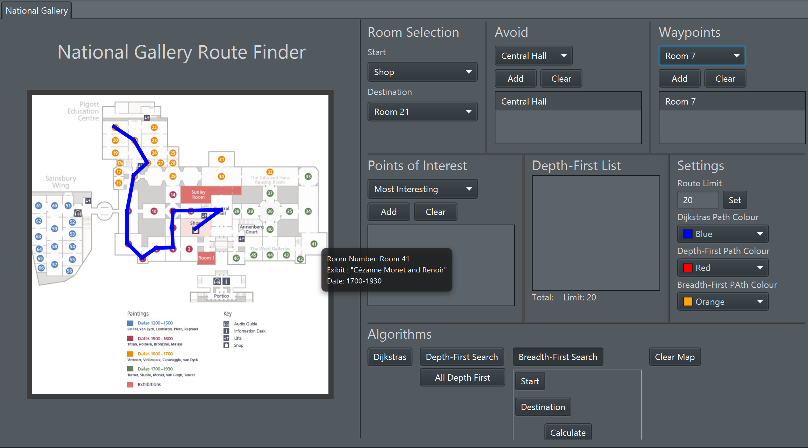

# JavaFx Path Finder

Group Project for Data Structures and Algorithms 2

Completed By Adam O'Brien, Corey Shanahan and Killian Halpin

-The aim of this Assignment was to create a JavaFX App that will find the shortest route from one room to another on the map 

-The Algorithms used are Dijkstra’s algorithm, breadth-first search and depth-first search

-The main features include: Shortest route using Dijkstra’s algorithm and breadth-first search, Waypoint support, Avoiding specified rooms/exhibits, Most interesting route using Dijkstra’s algorithm and Generating multiple valid route permutations using depth-first search

-Overall this assignment was graded at 90%

